# oneko-swift — native macOS port of oneko

A native Swift/AppKit port of the classic [oneko](https://github.com/adryd325/oneko.js):
a little cat that chases your mouse cursor around the screen. No Electron, no
dependencies.

## Install

### Via Homebrew

```sh
brew install --cask oneko-swift/tap/oneko
```

Homebrew 6+ asks you to trust third-party taps first: `brew trust oneko-swift/tap`.

### Manually

1. Download `Oneko-<version>.zip` from the
   [latest release](https://github.com/oneko-swift/oneko-swift/releases/latest).
2. Unzip it and drag `Oneko.app` into `/Applications`.
3. Authorize the app on first launch (below).

### First launch (both methods)

The app is not notarized, so Gatekeeper blocks the first launch:

1. Open `Oneko.app` once — macOS shows a warning and refuses to run it.
2. Go to System Settings → Privacy & Security, scroll down to the notice
   about Oneko and click **Open Anyway** (on macOS 14 and older you can
   instead right-click `Oneko.app` → Open).
3. Launch it again and confirm. The cat appears; this is only needed once.

Terminal alternative to step 2, same effect:

```sh
xattr -dr com.apple.quarantine /Applications/Oneko.app
```

Building from source (below) avoids the Gatekeeper step entirely.

## Build & run

```sh
./build.sh
open build/Oneko.app
```

Requires Xcode command line tools. No other dependencies.

## Features

- Borderless, transparent, **click-through** overlay — the cat never intercepts
  clicks and renders above every app, including full-screen apps, on all Spaces.
- Faithful port of the original state machine: 8-directional running, alert,
  idle, random face-washing and wall-scratching (when idling near a screen
  edge), tired → sleeping after prolonged inactivity.
- **Horizontal-only mode**: the cat ignores the cursor's vertical position and
  stays pinned to a row along the top or bottom screen edge, following only the
  cursor's x. It follows the cursor's _screen_ on multi-monitor setups (running
  to the new screen's edge row when the cursor changes displays) — same as in
  normal mode, where it simply chases the cursor across displays.
- **27 sprite variants**, grouped in the menu bar as Classic (cat, dog), X11
  Originals (tora, sakura, tomoyo, the BSD daemon) and Community (21 sheets of
  community pixel art). See the [gallery](#sprite-gallery) below.
- Menu bar item (cat icon): Show/Hide Cat, Speed (Slow/Normal/Fast), Sprite
  (grouped submenu — each entry shows the sprite's idle frame as its icon),
  Horizontal-Only Mode + Dock to Top/Bottom, Launch at Login, Quit.
- **Lightweight**: ~0.1% CPU idle, ~1.5% mid-chase, ~12 MB, exactly zero when
  hidden — see [Performance](#performance).

## Performance

Measured with `top` on an Apple Silicon Mac:

| State                         | CPU   | Memory | Power score |
| ----------------------------- | ----- | ------ | ----------- |
| Cat visible, idle or sleeping | ~0.1% | ~12 MB | ~0.4        |
| Cat chasing a moving cursor   | ~1.5% | ~12 MB | ~1.5        |
| Cat hidden                    | 0.0%  | ~12 MB | 0.0         |

Why it stays that cheap:

- **One timer, nothing else.** A single 100 ms `Timer` (20 ms tolerance, so
  wakeups coalesce with other system activity) drives the mouse poll, the state
  machine and the sprite swap. No display link, no event tap, no accessibility
  API — `NSEvent.mouseLocation` is a cheap read that needs no permissions.
- **No drawing code runs per frame.** The cat is one 32×32 `CALayer`; a frame
  change is a layer-contents swap to an already-decoded `CGImage`, and movement
  is a window-origin change. Scaling (nearest-neighbor, for crisp pixels) is
  done by the compositor.
- **Identical frames are never recommitted.** An idle or sleeping cat sends
  zero updates to WindowServer, even though the timer still polls the mouse
  10× per second.
- **Only the sprite sheet in use is resident** (~130 KB decoded). The 27 menu
  icons are standalone 32×32 copies, not crops retaining their full sheets.
- **Hide Cat means zero.** Hiding stops the timer, orders the window out and
  ends the app's activity assertion, so macOS puts the process in App Nap. No
  sleep assertions are ever held (`pmset -g assertions` stays clean).
- **320 KB universal binary, 768 KB bundle**, no frameworks beyond AppKit.

Check it yourself while the app runs:

```sh
top -l 3 -pid $(pgrep -x Oneko) -stats cpu,power,mem
```

## Layout

- `Sources/CatController.swift` — timer + state machine (port of oneko.js logic,
  adapted to AppKit's y-up coordinates)
- `Sources/TargetStrategy.swift` — the single swappable target-position piece:
  `FullChaseStrategy` (classic 2D) vs `HorizontalPinnedStrategy` (pinned row)
- `Sources/CatWindow.swift` — transparent click-through overlay window
- `Sources/SpriteSheet.swift` — slices the 256×128 sheets into frames; the
  sprite variant catalog (with menu grouping) lives here
- `Sources/AppDelegate.swift` — menu bar UI, settings (UserDefaults),
  launch-at-login via `SMAppService`
- `Resources/*.png` — the 27 sprite sheets, all in the oneko.js 256×128 layout
- `tools/makesheet.swift` — builds a sheet from the original X11 oneko XBM
  bitmaps + transparency masks, for any animal in the oneko sources
- `tools/makepreviews.swift` — regenerates the animated README previews in
  `docs/previews/` from `Resources/`

Settings persist in `defaults` domain `app.oneko.Oneko`.

## Sprite gallery

### Classic

| 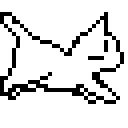 | 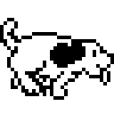 |
| :-----------------------------: | :---------------------------: |
|               Cat               |              Dog              |

### X11 Originals

| 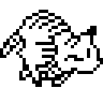 | 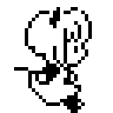 | 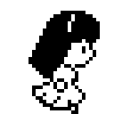 | 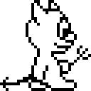 |
| :---------------------------------: | :---------------------------------: | :---------------------------------: | :---------------------------: |
|                Tora                 |               Sakura                |               Tomoyo                |          BSD Daemon           |

### Community

| 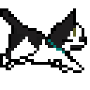 | 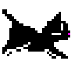 | 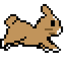 | 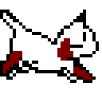 | 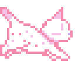 | 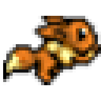 |
| :---------------------------: | :-------------------------------: | :-------------------------------: | :---------------------------------: | :-----------------------------------------: | :-------------------------------: |
|              Ace              |               Black               |               Bunny               |               Calico                |                 Catppuccin                  |               Eevee               |

| 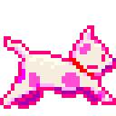 | 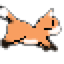 | 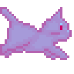 | 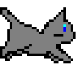 | 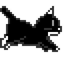 | 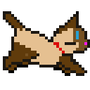 |
| :---------------------------------------: | :---------------------------: | :-------------------------------: | :-----------------------------: | :-----------------------------: | :-----------------------------: |
|                 Esmeralda                 |              Fox              |               Ghost               |              Gray               |              Jess               |              Kina               |

| 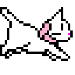 | 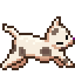 | 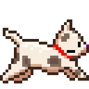 | 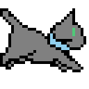 | 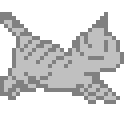 | 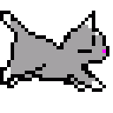 |
| :-----------------------------: | :-----------------------------: | :-------------------------------: | :-----------------------------: | :---------------------------------: | :---------------------------------------: |
|              Lucy               |              Maia               |               Maria               |              Mike               |               Silver                |                Silver Sky                 |

| 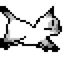 | 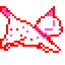 | 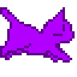 |
| :---------------------------------: | :---------------------------------------: | :---------------------------------------: |
|               Spirit                |                 Valentine                 |                 Vaporwave                 |

## Credits

All sprite art belongs to its original creators.

- **Cat** (`Resources/oneko.png`) — the classic oneko sprite set, taken from
  [adryd325/oneko.js](https://github.com/adryd325/oneko.js), which in turn
  traces back to the original X11
  [oneko](<https://en.wikipedia.org/wiki/Neko_(software)>) by Masayuki Koba.
- **Dog, Tora, Sakura, Tomoyo, BSD Daemon** — generated with
  `tools/makesheet.swift` from the original oneko XBM bitmaps and transparency
  masks (oneko-sakura sources, mirrored at
  [tie/oneko](https://github.com/tie/oneko)). Tora ships without its own masks
  upstream because it shares the cat's silhouette, so the cat masks are used.
  Sakura and Tomoyo are the Cardcaptor Sakura characters added by the
  oneko-sakura fork; the BSD daemon is the `oneko -bsd` variant.
- **Maia, Vaporwave** — from
  [kyrie25/spicetify-oneko](https://github.com/kyrie25/spicetify-oneko).
- **Catppuccin** — [k01e-01/catppuccineko](https://github.com/k01e-01/catppuccineko)
  (MIT), the oneko cat in [Catppuccin](https://github.com/catppuccin/catppuccin)
  colours.
- **All other Community sheets** (Ace, Black, Bunny, Calico, Eevee, Esmeralda,
  Fox, Ghost, Gray, Jess, Kina, Lucy, Maria, Mike, Silver, Silver Sky,
  Spirit, Valentine) — from the community-maintained Oneko Source
  Database, [tallypaws/oneko_db](https://github.com/tallypaws/oneko_db)
  (linked as the sprite source by
  [lots-o-nekos](https://github.com/raynepaws/lots-o-nekos)). The Fox sheet was
  padded from 255×127 back to the standard 256×128.
