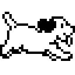
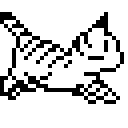

# oneko-swift — native macOS port of oneko

A native Swift/AppKit port of the classic [oneko](https://github.com/adryd325/oneko.js):
a little cat that chases your mouse cursor around the screen. No Electron, no
dependencies.

## Build & run

```sh
./build.sh
open build/Oneko.app
```

Requires Xcode command line tools. No other dependencies.

## Features

- Borderless, transparent, **click-through** overlay — the cat never intercepts
  clicks and renders above every app, including full-screen apps, on all Spaces.
- Faithful port of the original state machine: 8-directional running, alert,
  idle, random face-washing and wall-scratching (when idling near a screen
  edge), tired → sleeping after prolonged inactivity.
- **Horizontal-only mode**: the cat ignores the cursor's vertical position and
  stays pinned to a row along the top or bottom screen edge, following only the
  cursor's x. It follows the cursor's *screen* on multi-monitor setups (running
  to the new screen's edge row when the cursor changes displays) — same as in
  normal mode, where it simply chases the cursor across displays.
- **29 sprite variants**, grouped in the menu bar as Classic (cat, dog), X11
  Originals (tora, sakura, tomoyo, the BSD daemon) and Community (23 sheets of
  community pixel art). See the [gallery](#sprite-gallery) below.
- Menu bar item (cat icon): Show/Hide Cat, Speed (Slow/Normal/Fast), Sprite
  (grouped submenu — each entry shows the sprite's idle frame as its icon),
  Horizontal-Only Mode + Dock to Top/Bottom, Launch at Login, Quit.
- Lightweight: one 100 ms timer polling `NSEvent.mouseLocation` (no
  accessibility permission needed), ~0.1% CPU.

## Layout

- `Sources/CatController.swift` — timer + state machine (port of oneko.js logic,
  adapted to AppKit's y-up coordinates)
- `Sources/TargetStrategy.swift` — the single swappable target-position piece:
  `FullChaseStrategy` (classic 2D) vs `HorizontalPinnedStrategy` (pinned row)
- `Sources/CatWindow.swift` — transparent click-through overlay window
- `Sources/SpriteSheet.swift` — slices the 256×128 sheets into frames; the
  sprite variant catalog (with menu grouping) lives here
- `Sources/AppDelegate.swift` — menu bar UI, settings (UserDefaults),
  launch-at-login via `SMAppService`
- `Resources/*.png` — the 29 sprite sheets, all in the oneko.js 256×128 layout
- `tools/makesheet.swift` — builds a sheet from the original X11 oneko XBM
  bitmaps + transparency masks, for any animal in the oneko sources
- `tools/makepreviews.swift` — regenerates the animated README previews in
  `docs/previews/` from `Resources/`

Settings persist in `defaults` domain `com.michael.oneko`.

## Sprite gallery

### Classic

|  |  |
|:---:|:---:|
| Cat | Dog |

### X11 Originals

|  |  |  |  |
|:---:|:---:|:---:|:---:|
| Tora | Sakura | Tomoyo | BSD Daemon |

### Community

|  |  |  |  |  |  |
|:---:|:---:|:---:|:---:|:---:|:---:|
| Ace | Black | Bunny | Calico | Catppuccin | Eevee |

|  |  |  |  |  |  |
|:---:|:---:|:---:|:---:|:---:|:---:|
| Esmeralda | Fox | Ghost | Gray | Jess | Kina |

|  |  |  |  |  |  |
|:---:|:---:|:---:|:---:|:---:|:---:|
| Lucy | Maia | Maria | Mike | Silver | Silver Sky |

|  |  |  |  |  | |
|:---:|:---:|:---:|:---:|:---:|:---:|
| Snuupy | Spirit | Tora (Color) | Valentine | Vaporwave | |

## Credits

All sprite art belongs to its original creators.

- **Cat** (`Resources/oneko.png`) — the classic oneko sprite set, taken from
  [adryd325/oneko.js](https://github.com/adryd325/oneko.js), which in turn
  traces back to the original X11
  [oneko](https://en.wikipedia.org/wiki/Neko_(software)) by Masayuki Koba.
- **Dog, Tora, Sakura, Tomoyo, BSD Daemon** — generated with
  `tools/makesheet.swift` from the original oneko XBM bitmaps and transparency
  masks (oneko-sakura sources, mirrored at
  [tie/oneko](https://github.com/tie/oneko)). Tora ships without its own masks
  upstream because it shares the cat's silhouette, so the cat masks are used.
  Sakura and Tomoyo are the Cardcaptor Sakura characters added by the
  oneko-sakura fork; the BSD daemon is the `oneko -bsd` variant.
- **Maia, Vaporwave** — from
  [kyrie25/spicetify-oneko](https://github.com/kyrie25/spicetify-oneko).
- **Catppuccin** — [k01e-01/catppuccineko](https://github.com/k01e-01/catppuccineko)
  (MIT), the oneko cat in [Catppuccin](https://github.com/catppuccin/catppuccin)
  colours.
- **All other Community sheets** (Ace, Black, Bunny, Calico, Eevee, Esmeralda,
  Fox, Ghost, Gray, Jess, Kina, Lucy, Maria, Mike, Silver, Silver Sky, Snuupy,
  Spirit, Tora (Color), Valentine) — from the community-maintained Oneko Source
  Database, [tallypaws/oneko_db](https://github.com/tallypaws/oneko_db)
  (linked as the sprite source by
  [lots-o-nekos](https://github.com/raynepaws/lots-o-nekos)). The Fox sheet was
  padded from 255×127 back to the standard 256×128.
